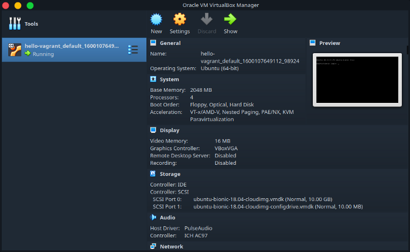
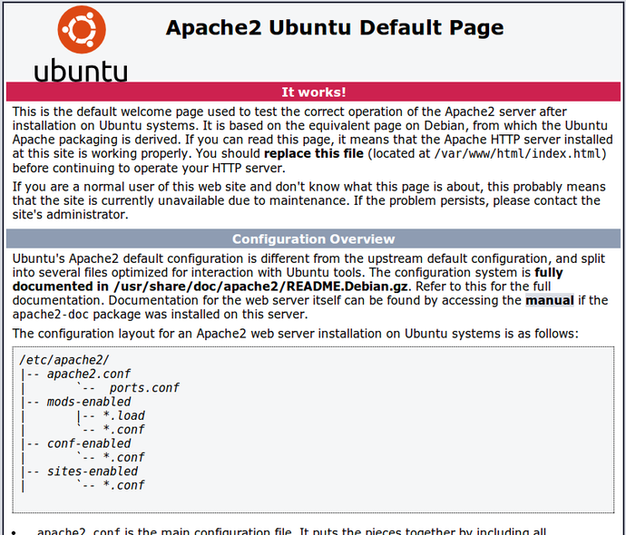
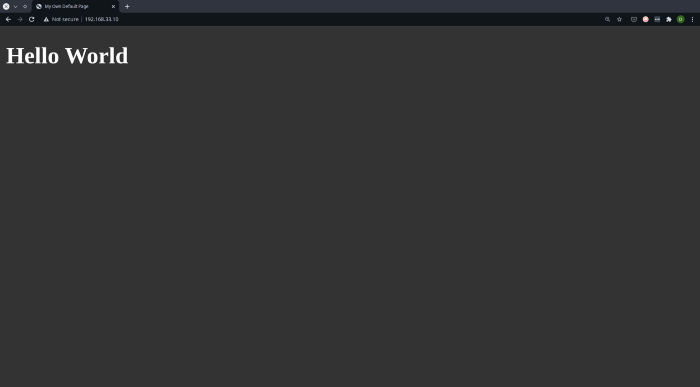

Virtual Machines, or VMs for short, are fairly popular in the Software industry
and among developers. And for good reason — who would mind a disposable OS,
within an OS! Right? They are fairly easy to use, allow you to run multiple
OS’s on a single host OS, completely independent of each other
(okay, there are some limitations in performance compared to bare metal performance,
but let’s leave that aside for now).

One of the bigger problems with using VMs that I felt prevented them from being as
convenient as, say, an actual local environment, was the initial setup.
Setting up a VM and getting it ready to use for development inside a
VM manager like [VirtualBox](https://www.virtualbox.org/) wasn’t exactly
a click-click-done process. You needed to:

- Find and download an installation image file for your OS of choice.
- Create your VM.
- Boot up your VM, and install each development software and package you needed.

Yeah, that takes quite some time.
But when you’re someone who wants a consistent development environment
without having to install an infinite amount of software, from programming
language runtimes to database servers on your local machine, VMs are definitely
a very attractive solution.
If you’re someone like this, and you’ve been unaware, allow me to introduce you to the extreme convenience that is Vagrant.

Using Vagrant requires you to install a single installable package,
which you can get from here for your OS.
The installation process is trivial really,
but do remember to ensure that
[virtualization support is enabled](https://www.isunshare.com/blog/how-to-enable-virtualizationvt-in-bios-for-hyper-v-windows-10/)
in your BIOS settings.
Vagrant also requires a VM “provider”, such as VirtualBox or
VMWare Fusion to be installed on your system.
We’ll be using the free and open-source VirtualBox.

First and foremost, what is Vagrant?
The official documentation briefly calls it
"the command line utility for managing the lifecycle of virtual machines".
That’s all you really need to know.
Let’s work with it to gain an idea of what it can do for you.

A Vagrant box, which is nothing but a Vagrant-controlled VM,
is brought up based on a configuration file, which is called,
by convention, a Vagrantfile (Yes, like a Dockerfile!).
A Vagrantfile has 5 main config blocks:

1. **box**: The “box” to start with.
   A box is like a template that forms the base for your Vagrant box.
   Essentially, what “images” are to a Dockerfile, a “box” is to a Vagrantfile.
   They contain a base OS and, optionally, additional configurations and
   installed software/packages.
   To see openly available Vagrant boxes, you can go here.
1. **provider**: As mentioned earlier, Vagrant supports a number of VM
   managers or “providers”, including but not limited to VirtualBox,
   VMWare Fusion, and Docker. Not all providers support all base boxes,
   but you do not need to worry about that yet.
   The documentation can help you understand more about the supported
   providers.
1. **network**: This is the network configuration, such as forwarding ports to
   the host machine, binding the VM to particular private IP, etc.
1. **synced_folder**: Synced folders parallel volume bind mounts from docker.
   What they allow, essentially, is to sync directories between your host and
   the VM. This could allow you to have setups where you may, for example,
   edit code on your local code editor but see changes reflected in real-time
   inside the VM.
1. **provision**: A vanilla base box is rarely of any use without necessary packages
   installed and the environment configured. The provision block is where you
   "provision" your VM with necessary changes, and installations through, say,
   shell scripts.

You don’t need to use all the blocks in all cases.
Using Vagrant regularly, you’ll eventually gain a feel of what you
need and what you don’t. The documentation is always there to help you.

Bored with the theory? Let’s write some config files!
Create a text file names Vagrantfile (no extensions).
Now, Vagrantfiles are Ruby-based, I believe. But fret not.
I do not know Ruby. You don’t need to know Ruby either.

Let’s write up the Vagrantfile:

```ruby
Vagrant.configure("2") do |config|

  # Box Config
  config.vm.box = "ubuntu/bionic64"

  # Provider Config
  config.vm.provider "virtualbox" do |vb|
    vb.memory = 2048
    vb.cpus = 4
  end

  ## Run VM on private IP
  config.vm.network "private_network", ip: "192.168.33.10"

  # Volume Mounts
  config.vm.synced_folder "./var-www-html", "/var/www/html", :mount_options => ["dmode=777", "fmode=666"]

  # Provisioning via a script
  config.vm.provision "shell", path: "bootstrap.sh"

end
```

Don’t be confused. It’s super simple.
Let’s go line by line (or block by block).

- The outermost block simply specifies the Vagrant configuration version.
  Until Vagrant updates a major version, this should remain the same across
  Vagrantfiles. Inside it, you define the 5 blocks for your Vagrantfile.

```ruby
Vagrant.configure("2") do |config|
    #
    # Rest of the config goes here
    #
end
```

- Next, we define the box to use as the base. We use an Ubuntu 18.04 box,
  listed on https://app.vagrantup.com.

```
    config.vm.box = "ubuntu/bionic64"
```

- We now have told the Vagrantfile the OS we want. But Vagrant can’t create
  VMs itself. It needs a provider. Let’s tell Vagrant to use VirtualBox.
  The provider box will also allow us to configure the resources used by the
  VM. Here, we’ll explicitly tell Vagrant to use 2GB of memory and 4 vCPUs.

```
    config.vm.provider "virtualbox" do |vb|
        vb.memory = 2048
        vb.cpus = 4
    end
```

- The VM would work even without a networking block. But just so we
  could enjoy our final result later, we’ll bind the VM to an address
  in the “private_network”.

```
    config.vm.network "private_network", ip: "192.168.33.10"
```

- The synced_folder config, like the network config, is one of those
  configs which you use as needed. It can be left out if you feel you
  don’t need to sync directory(s) between the host and the VM.
  We bing a folder in our working directory names “var-www-html” to the
  directory `/var/www/html` inside the VM, and set up file and directory
  permissions in the `:mount_options` block.
  I believe this syntax is ruby-based, so it isn’t the most intuitive,
  but hopefully, you can make sense of what is happening.

```
    config.vm.synced_folder "./var-www-html", "/var/www/html", :mount_options => ["dmode=777", "fmode=666"]
```

- Finally, we can configure the vanilla VM. This we do via a bash script.
  I’ll use a bash script to install LAMP server packages in the VM,
  named “bootstrap.sh” kept in the working directory alongside the Vagrantfile.

```
    config.vm.provision "shell", path: "bootstrap.sh"
```

The shell script is trivial. It is nothing but a series of `apt-get install`
commands. Note that the script is run as root, so using sudo is unnecessary:

```bash
apt-get update
apt-get install apache2 -y
apt-get install mysql-server -y
apt-get install php libapache2-mod-php php-opcache php-cli php-gd php-curl php-mysql -y
systemctl restart apache2
```

What we should have now is a directory structure looking like this:

```
| var-www-html/
| bootstrap.sh
| Vagrantfile
```

Now, we let Vagrant do its magic. Go to your command line and type in the magic words.

```bash
vagrant up
```

What you should see is a ton of console output going by,
ending with you back in your terminal prompt. Checking VirtualBox will
tell you that the VM definitely up (the VM’s name may vary).



And since we installed the Apache server on the VM as well,
visiting the IP you used in your network config (192.168.33.10 in my case)
should greet you with the default Apache page. That is confirmation
that out provision (or at least some of it) worked.



Feels magical? You haven’t yet noticed the `index.html` file that magically
appeared inside `var-www-html/`. The file was created during the Apache
server’s installation and represents the above page, which gets served to
you when you visit the VM’s private IP. Let’s change the `index.html` file.

Replace all content inside `var-www-html/index.html` with:

```html
<!DOCTYPE html>
<html lang="en">
  <head>
    <meta charset="UTF-8" />
    <title>My Own Default Page</title>
  </head>
  <style>
    body {
      background: #333;
      color: #fff;
    }
  </style>
  <body>
    <h1>Hello World</h1>
  </body>
</html>
```

Go back to the VM IP inside your browser, or simply reload the page if
you’re already there. You should now see your very own page.
"Hello World" in dark mode 💯.



It really is cool, isn’t it? The benefits of declarative configuration approaches
cannot be overstated. The rise of declarative configurations in technologies
like Terraform, Docker, Kubernetes, and Ansible among many others is
testimony to their usefulness.

Using VMs may or may or be for you, and their need may vary from person to person
and company to company. But there is no denying the convenience Vagrant
brings in.

I’ll leave you with some other basic commands used for Vagrant VMs.
Most of these need you to be in the same working directory as the Vagrantfile.

- **`vagrant destroy`** forcefully destroys the VM. You won’t be able to reboot it. vagrant up again should create a new VM.
- **`vagrant halt`** halts or suspends the VM, so that you may later start it again with vagrant resume
- **`vagrant init`** will generate for you a basic Vagrantfile with helpful comments. It may be a good starting point for your VMs.
- **`vagrant ssh`** ssh’s you into the VM, if you feel the need to do so.

That’s it for now, dear reader. Until the next time I get excited about something enough to write about it, take care and happy learning 😄
