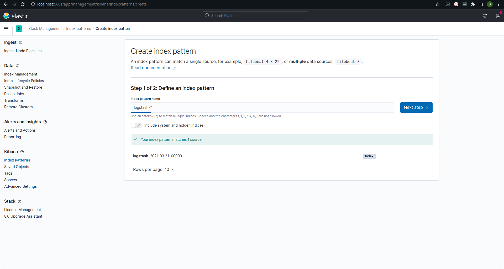
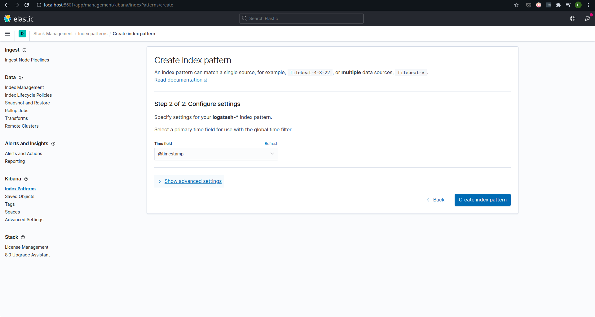
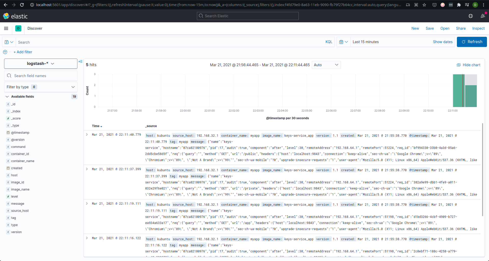
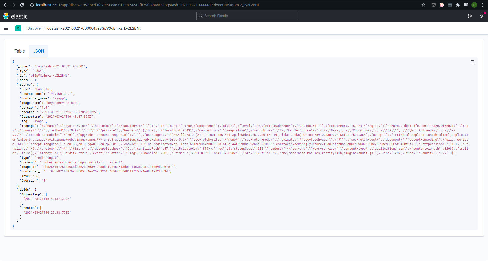

Before the rest of the article, let’s all agree that generating proper logs
is crucial for any application in production.
Whether it be structured logging, such as in JSON format,
or just plain strings printed, there must always be some form of
trail on what the software is doing, to be used when (not if) the application misbehaves.
Here I use “application” as a general term to describe any
kind of software or code or tool that can potentially behave unexpectedly.

Generating logs is not enough of course.
What use are logs that aren’t there when you need them?
Generated logs must be persisted in some way, and be made readily available
to stakeholders such as software engineers, system administrators,
and others with access to the systems in times of need.
How they are persisted varies, based on the amount of logs and the
rate at which they are being generated.

- If an application logs at a slow to medium rate, such that writing to disk is feasible,
  then log files can be all you need.
  Setup your Linux system to rotate the log
  file on schedule and send the files off to persistent storage such as a backup disk or
  AWS S3 and you’re good. When required, the
  logs can be accessed and queried using tools grep or regular text editors.
- Sometimes logging to a file does not cut it.
  Not many people are wizards on Linux command line tools, to be able to
  dissect and search through massive log files for exactly what they want all
  within their terminals. And even if they are, it’s a bit too hard to replicate what,
  say, an SQL query could do on the command line itself.
  In the case that querying the logs is a requirement you feel to be important,
  even if logging becomes a bit slower, it is ideal to store your logs to a database.
  Be it a relational database such as MySQL or a document-based database like MongoDB,
  the writes will become slower than writing to a disk. However,
  anyone comfortable with these databases’ querying languages should be able to form
  fairly complex queries quickly to be able to get exactly the data they want.

Even when you’re using Docker, both the above approaches are viable.
For logging to file, you could add a volume mount to the container to access the
logs from outside the container.
For using a database, you could just spin up a database container and persist
the data (in case your application isn’t already using one).

However, both of the above approaches put the job of actually
persisting the logs (to disk or to a database) to the application itself.
While modern logging libraries are pretty well optimized to handle
multiple streams and large amounts of data concurrently,
logging may still become a bottleneck to an application’s performance
if there are, say, too many database connections being created or if the
system’s disk itself is slow. It might sometimes make sense to let some other tool
handle the logs for your application, while the application itself does
nothing but throw out logs to stdout, as is the Docker way of logging.

How does this approach work? Simple.

- Your application generates logs and sends them to stdout or stderr.
- The docker logging driver sends these logs onto a UDP endpoint (which is, in fact, a Logstash instance).
- Logstash sends these logs to Elasticsearch where they get indexed and persisted.

Why this approach? Because Kibana. The ease of use and querying that comes through
the use of Kibana cannot be overstated. And, of course, Elasticsearch is very
fast when it comes to searching. Just to be clear, I understand and you should too,
that Kibana is a generalized visualization tool, and using it for analyzing logs is
just one of the things it can do. You can see filter logs by the container that generated them,
the timestamps, and you can even add custom filters.
The complete powers of Kibana are beyond the scope of this article and
I leave it as an exercise for the interested reader.

How do we do this? To start, you need an ELK stack set up where we can push our logs to.
You could install each of these components and configure them if you feel so inclined.
For this article, however, I’ll be using docker-compose to run all the services inside
Docker containers.

The stack works like so:

- We have one container running Elasticsearch.
- We have one container running Kibana that connects to the Elasticsearch instance.
- We have a Logstash “agent”, whose sole job is to take any incoming logs coming on
  the gelf interface and shove them into a Redis instance, which acts like a logs buffer.
- A “central” Logstash container reads logs from the Redis buffer and shoves
  them into Elasticsearch, from where they become available to the Kibana service.

Straightforward enough? Let’s write that down in a Docker-compose file.
Thankfully, getting all of this setup doesn’t take much.
Let’s check out the services in our docker-compose file one by one.

## Docker-Compose

### Elasticsearch

```yaml
elasticsearch:
  image: elasticsearch:7.11.1
  environment:
    - discovery.type=single-node
  volumes:
    - ./elasticsearch_data/:/usr/share/elasticsearch/data
  mem_limit: "1g"
```

Simple. The environment variable `discovery.type` tells the elasticsearch engine
that it’s running as a single node rather than a cluster.
The volume mount ensures that elasticsearch data is persisted across container restarts.
The `mem_limit` attribute is there because my humble laptop could not handle the full strength
of an elasticsearch engine. Yours might be able to handle a 2g memory limit,
but test that at your own risk.

### Redis

```yaml
redis-cache:
  image: redis:6.2
```

We’ll leave Redis with the default config for the purpose of this article.

### Logstash (Agent)

```yaml
logstash-agent:
  image: logstash:7.11.1
  volumes:
    - ./logstash-agent:/etc/logstash
  command: logstash -f /etc/logstash/logstash.conf
  depends_on:
    - elasticsearch
  ports:
    - 12201:12201/udp
```

The agent exposes the UDP port 12201, onto which our application docker container will
send its logs. We mount a directory logstash-agent containing our `logstash.conf` which will
configure the logstash instance instance to send incoming data to our redis instance.
The `logstash.conf` can be something like this:

```
input {
    gelf {
        port => 12201
    }
}

output {
    redis {
        host => "redis-cache"
        data_type => "list"
        key => "logstash"
    }
}
```

Gelf is a logging format that we will be using for our application docker containers’
log outputs, through the gelf logging driver.
You can learn more about gelf [here](https://www.graylog.org/features/gelf).

### Logstash (Central)

The “central” logstash instance does the actual work in the sense that it takes the
logs from Redis and pushes them to elasticsearch, where they get indexed and become available to use.

```yaml
logstash-central:
  image: logstash:7.11.1
  volumes:
    - ./logstash-central:/etc/logstash
  command: logstash -f /etc/logstash/logstash.conf
  depends_on:
    - elasticsearch
```

The configuration file `logstash.conf` is mounted, in the logstash-central directory.

```
input {
    redis {
        host => "redis-cache"
        type => "redis-input"
        data_type => "list"
        key => "logstash"
    }
}

output {
    elasticsearch {
        hosts => ["elasticsearch:9200"]
    }
}
```

### Kibana

All kibana needs to know is where Elasticsearch is. And we expose port 5601 to access the web interface.

```yaml
kibana:
  image: kibana:7.11.1
  ports:
    - 5601:5601
  environment:
    - ELASTICSEARCH_HOSTS=http://elasticsearch:9200
  depends_on:
    - elasticsearch
```

The complete Docker-compose file looks like this:

```yaml
version: "2.1"

services:
  elasticsearch:
    image: elasticsearch:7.11.1
    environment:
      - discovery.type=single-node
    volumes:
      - ./elasticsearch_data/:/usr/share/elasticsearch/data
    mem_limit: "1g"

  redis-cache:
    image: redis:6.2

  logstash-agent:
    image: logstash:7.11.1
    volumes:
      - ./logstash-agent:/etc/logstash
    command: logstash -f /etc/logstash/logstash.conf
    depends_on:
      - elasticsearch
    ports:
      - 12201:12201/udp

  logstash-central:
    image: logstash:7.11.1
    volumes:
      - ./logstash-central:/etc/logstash
    command: logstash -f /etc/logstash/logstash.conf
    depends_on:
      - elasticsearch

  kibana:
    image: kibana:7.11.1
    ports:
      - 5601:5601
    environment:
      - ELASTICSEARCH_HOSTS=http://elasticsearch:9200
    depends_on:
      - elasticsearch
```

With our directory structure being like so:

```
| elasticsearch_data/
| logstash-agent/
| logstash.conf
| logstash-central/
| logstash.conf
| docker-compose.yml
```

A docker-compose up here should do the trick, spinning up your very own ELK stack,
ready to ingest any logs you throw at it!
To access the Kibana dashboard, go to http://localhost:5601/ in your browser.
However, there aren’t any logs to be viewed yet.
Beware that the service may take a minute or two to initialize,
so don’t worry if there’s nothing on the webpage yet.

Now let's do what we came to do — create a container and put out some fresh logs.

## Generating logs

Let’s keep it simple. My service will be a small Node server with three endpoints.
What the server does and what the endpoints do is irrelevant in this context.
We will consider this service to run in a separate docker-compose environment, and it will
access Logstash via the exposed port 12201.

The docker-compose file will be as follows:

```yaml
version: "2.1"

services:
  app:
    container_name: "myapp"
    build: .
    ports:
      - "9843:9843"
    environment:
      - "NODE_ENV=dev"
      - "HOST=0.0.0.0"
      - "PORT=9843"
    logging:
      driver: gelf
      options:
        gelf-address: "udp://localhost:12201" # Logstash UDP input port
        tag: "myapp"
    restart: always
```

Essentially, we build a Dockerfile in the same directory as this docker-compose file,
and it starts a server on port 9843 internally, which we expose to port 9843 on the host.
There is some environment configuration, which you, as a reader, do not need to care about.
Our logging configuration is all within the block called, drum roll please, **logging**.

```yaml
logging:
  driver: gelf
  options:
  gelf-address: "udp://localhost:12201"
  tag: "myapp"
```

We tell docker-compose to use the “gelf” driver rather than the default
(which is the “local” driver, I think).
We configure the driver under the options block.
We specify the UDP endpoint where the logs need to be sent,
and a tag for all the logs from this service, which will be added
to the logs being sent in the GELF format.

In practice, you could have any number of docker-compose services,
configure it’s logging driver like so, and have all your logs from all of
your services centralized to a single location. How awesome is that!?

## Viewing the results

Now, going into Kibana, you will have to specify a default index to use
when you go to the Elasticsearch logs section for the first time.
Since we are using Logstash, the index is of the form `logstash-\*` unless
you have messed with the logstash configuration on your own
(in which case you probably understand the index to specify, right?).



You will also have to specify the time field in the next step.
Since we use GELF input, this will be the `@timestamp` field.



On clicking `Create index pattern`, you should now be able to go to
http://localhost:5601/app/discover/ to view logs from the server application
in all their beauty. In case you see no logs, try adjusting the time duration filter,
or ensuring that some logs are in fact being generated by the application.
Try sending some requests to the application to get some logs pumping.



Isn’t that really nice? There you have all your logs, available and ready to be analyzed.
If you’re new to Logstash and Kibana (like me), it’s nice to play around and see what
Kibana can do for you. Given the current configuration, the actual incoming logs that
your application created are available as a string in the `message` key.



It is, I believe, possible to have the log “message” itself be parsed and made filterable. That could give to you ultimate power. Perhaps try to work that out. And maybe let me know too. Or maybe I’ll update this article once I do figure out.

## On Scalability

Can this ELK setup scale? I think it might, to a good extent.
We can have multiple central Logstash instances ingesting logs from the Redis database,
which can itself be scaled to multiple nodes with replication.
Elasticsearch itself can be set up to run in a cluster of multiple nodes
to aid with high availability. The Redis buffer ensures some amount of rate
limiting on the incoming logs since the consumer Logstash instances can pick up
the logs at their own pace, allowing the Elasticsearch engine sufficient time to index the
data.

That's it for now, dear reader. Until next time, happy learning.

In case you wanna discuss something about this article or tech in general,
feel free to reach out to me!
