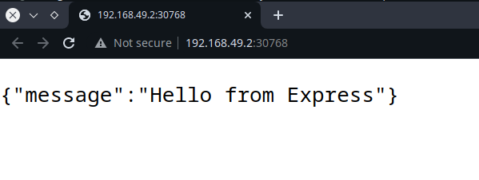

Kubernetes, or K8s for short, isn't new. It's been around for about seven years now.
Seven years isn't a very long time in tech terms, but over this time K8s has evolved rapidly,
giving rise to a mature ecosystem, with flavors and distributions of K8s to fit almost any business need.

For software engineers who've been working with backend technologies, who've perhaps come across
and worked with Docker, K8s can sometimes seem like a different beast.
Like it is a technology you need to take a long time to just start with, let alone master.
I understand because I sometimes felt similarly. But let's clear up these thoughts a little.

Yes, you'll probably never completely master Kubernetes. It's too vast and there is too much to learn.
Instead, you'll eventually get a better understanding of the core features of Kubernetes as you work with it
and be able to understand what you need it to do.
Research, figure out that new K8s plugin that could help you achieve your goal, use it, and get your use case working.
Rinse and repeat. Maybe write a blog post about it. This, in my opinion, is the better approach to get used to K8s:
use it, and learn what you need to, to be able to use it better.

No, it isn't all that hard to get started. Let's see how.

## Basic Kubernetes terminology

- **Node**: A node is an actual operating system/virtual machine running kubernetes
- **Cluster**: A cluster is a set of nodes. One of these nodes becomes a master while the others are workers.
- **Pod**: You can think of pods as kubernetes' abstraction over containers. Kubernetes will never deal directly with out actual containers. Instead, it manages pods. Each pod may have multiple containers running under it, but often, a 1 to 1 pod to container mapping is the norm, that is, each pod runs a single container. If you think of pods as something like a container, you wouldn't be too wrong. This is the smallest unit of deployment in Kubernetes.
- **ReplicaSet**: A replicaset manages pod operations, such as scaling up pods, restarting broken pods, etc. Essentially, it maintains the replication status of your kubernetes pods.
- **Deployments**: Deployments manage replicasets, and are also responsible for updating pods when necessary. Often, replicasets in Kubernetes are not managed by users. Instead, users manage Deployments, which inturn automatically manage replicasets.
- **Service**: Services in Kubernetes are used to expose applications running within pods to the internal kubernetes network as well as to the outside world. There are four kinds of deployments:
  - **ClusterIP**: Exposes service ports internally within kubernetes.
  - **NodePort**: Exposes service ports outside of the kubernetes cluster. Generally only used for development purposes.
  - **LoadBalancer**: Exposes the service externally using a cloud provider's load balancer, automatically managing ClusterIPs and NodePorts. This is the general preferred method to exposing applications outside kubernetes.
  - **ExternalName**: According to the official Kubernetes documentation, ExternalName services map the Service to the contents of the externalName field (e.g. foo.bar.example.com), by returning a CNAME record with its value. No proxying of any kind is set up. To put it in very basic terms, it will act as an actual DNS CNAME record, and can be used for introducing redirections.

## Setting up for local development

To develop for Kubernetes locally, there are some things you will need to set up.

- First of all, you will need a container runtime. [Docker](https://docs.docker.com/get-docker/) is the most popular one, although Kubernetes can also support other container runtimes.
- Next, you need a Kubernetes cluster. You could use a cloud service, or you could set up a local cluster using a tool like [**Minikube**](https://minikube.sigs.k8s.io/docs/), which is what I'll be using. If you're on Windows or Mac using Docker for desktop, I believe you can also start up Kubernetes from the Docker desktop app, without having to manually install anything. I am currently using Linux and don't have that luxury.
- Once you have a cluster running, you need to be able to access and control the Kubernetes cluster. [**kubectl**]() is the tool to help you do that.

With these tools on your machine, you should be ready to go. Let's open up a code editor inside an empty directory, and try to get some code running inside Kubernetes ASAP.

## Creating the Express.js server

Let's create an express server. Run `npm init -y` to set up a Node.js project, and install express using `npm install express`.

Create an `index.js` file inside your working directory and let's set up a root `/` route handler, running the server on port 3000:

```js
// index.js
const express = require("express");

const app = express();

app.all("/", (req, res) => {
  res.send({ message: "Hello from Express" });
});

const PORT = 3000;
app.listen(PORT, () => {
  console.log(`listening on port ${PORT}`);
});
```

Update the `package.json` file to add a `start` script.

```json
 "scripts": {
    "start": "node index.js"
  },
```

You can run npm start right now on your machine and go to `http://localhost:3000/` on your machine to view the fruits of your labour. But we're not done yet. Let's dockerise this server.

## Dockerizing the Express server

Create a `Dockerfile` inside your working directory to copy `package.json` into the container, install necessary packages, copy `index.js` into the container and then run `npm start` on startup. Very simple.

```Dockerfile
# Dockerfile
FROM node

COPY package*.json ./
RUN npm install

COPY index.js index.js

CMD ["npm", "start"]
```

Please do not use this Dockerfile in production. Learn more about docker before you're putting containers into production.

Remember to also create a .dockerignore file so that docker ignores the `node_modules` directory.

```
# .dockerignore
node_modules/
```

Kubernetes does not build your Docker images. So we'll have to do that manually. In your terminal, from inside your working directory, you can run:

```
$ docker build -t index-to-k8s-node .
```

We have tagged the image `index-to-k8s-node` using the `-t` flag so we can easily refer to it later.

## To Kubernetes

Ensure that your Kubernetes cluster is running. If you're running minikube the `minikube status` and `minikube start` commands should be helpful. You can also check if your cluster is running with the command `kubectl get pods -A`. You should be able to see some 4 or 5 pods listed. These are Kubernetes managed pods and you should avoid messing with them unless you know what you're doing.

Now, the `kubectl` allows two methods for managing your cluster. The imperative approach is the one where you use the kubectl command line to manage your k8s resources. The declarative approach allows you to specify the state of your cluster inside yaml configuration files. We'll be following the latter approach. The imperative approach works well only for testing stuff or to troubleshoot issues when you're in a pinch. In general, you should focus on learning the declarative approach, and figure out the imperative (command-based) approach whenever you feel like you need it.

With that out of the way, let's consider what Kubernetes resources we would need to run our container on kubernetes.

- We could run a Pod containing the container, by itself.
- We could run a Deployment for the application, that would manage Pods and ReplicaSets by itself.

The former approach isn't really good at all. If the container goes down, nothing will get it up and running again. Scaling up the application horizontally would mean running another Pod manually rather than simply updating a Deployment configuraion, like we could if we used the latter approach. The second approach is better, and is the one we'll be going with.

Besides the deployment, we would also need to create a service to expose our application. We do not need internal networking withing our cluster, so a ClusterIP won't be needed. However, we do want to expose our service to our local machine. A NodePort could be ideal for our scenario, so that is what we will use.

To get this done, we'll create a new directory inside our working directory and call it `k8s`.

Inside we will create two configuration yaml files. One will be for our deployment (`depl.yaml`), and one will be for our NodePort service `svc.yaml`.

`depl.yaml` could look something like this:

```yaml
# depl.yaml
apiVersion: apps/v1
kind: Deployment
metadata:
  name: node-app
spec:
  replicas: 1
  selector:
    matchLabels:
      app: node-app
  template:
    metadata:
      labels:
        app: node-app
    spec:
      containers:
        - name: name
          image: index-to-k8s-node:latest
          imagePullPolicy: Never
          resources:
            limits:
              memory: "256Mi"
              cpu: "500m"
```

It's not overly complicated, and perhaps it might get you thinking "Hey, this k8s thing might not be that hard afterall, huh?". Unfortunately, this won't be even the tip of the iceberg that is k8s.
Still, this should be enough to get us going. Let' analyze the yaml content, block by block.

```
apiVersion: apps/v1
kind: Deployment
metadata:
  name: node-app
```

- The `apiVersion` tag is necessary for Kubectl to know which specific reosurce version you are referring to.
  The definition and the availability of these resources may vary from version to version, so ensuring the correct version becomes important.
  Not all k8s resources are available in all k8s api versions.
- `kind` tells k8s the kind of resource you want to create (mind = blown).
- The `metadata` tag doesn't impact k8s behavior at all. It is only for the users, and can be used to identify unique resources in a k8s cluster.

Next comes the `spec` block. This is where we define the spec, or the specification, of the resource we are tryning to create, which is a Deployment in our case.

```
  replicas: 1
  selector:
    matchLabels:
      app: node-app
```

- `replicas` tells k8s the number of pods you want to run inside of this deployment.
- The `selector` attribute is used for adding labels to your resources. Rather than referring to individual pods or resoruces, in k8s you'll often find yourself referring to particular resources by labels, as you will also see later in this article.

Next comes the `templates` tag. In this tag, we provide the specifications of the pods we want running inside of our deployment. The first block, `metadata` is... err... metadata. Same as the one in the parent Deployment block.

```
    metadata:
      labels:
        app: node-app
```

Now inside `spec`, we actually configure our pod.

```
    spec:
      containers:
        - name: name
          image: index-to-k8s-node:latest
          imagePullPolicy: Never
          resources:
            limits:
              memory: "256Mi"
              cpu: "500m"
```

- `containers` is a list of contianers that we want to have running inside of each pod. Here, we define exactly one container.
- Each container has a `name`, and an `image`. Notice that the image name is the name with which we tagged our Node.js image earlier.
- The `imagePullPolicy` tells k8s when or if it should attempt to pull the specified resource from a remote registry. The default, `Always`, tells k8s to always pull the image on pod startup. In our case, since we only have the image available locally on our system, we set the policy to `Never`, telling k8s to only look for the image on our system. If the image is not found locally, the pod will simply never startup.
- Under the `resources` tag, we limit the maximum cpu and memory that a container is allowed to take up on our system.

There we have it. A Node.js kubernetes deployment in all it's glory.

We could totally run this on our cluster. But it wouldn't be much use since we would have no way to access our server. For doing that, we must also set up a Service. A NodePort will allow us to expose our server on the host, which is our machine.

The configuration for the NodePort service is rather simple.

```yaml
# svc.yaml
apiVersion: v1
kind: Service
metadata:
  name: node-app
spec:
  selector:
    app: node-app
  type: NodePort
  ports:
    - name: node-app
      port: 3000
      targetPort: 3000
```

The `kind`, `apiVersion`, `metadata` and `spec` tags correlate exactly with their roles in `depl.yaml`.

However, inside `spec` pay notice to the `selector` block.

```
  selector:
    app: node-app
```

This block tells the NodePort service which particular resources it should route to. So, we are telling our service this: "Please be associated with resources that have the label app=node-app attached to them". And which resource is that? Our Deployment of course! You can go back and ensure that the selector we added to our Deployment spec infact matches this one.

```
  type: NodePort
  ports:
    - name: node-app
      port: 3000
      targetPort: 3000
```

- `type` is the type of Service, which is a NodePort in our case.
- `ports` is a list of port mappings. The `name` is pretty much for our identification. `port` specifies the external port (that is, the port on the host), and `targetPort` is the port of the container that the `port` should map to.
  So essentially, here we are telling the NodePort service to map port 3000 on our machine to port 3000 of the container.

## Deploying K8s resources

Now, with these two files we should be ready. To be sure, your working directory's structure should now look something like this:

```
| k8s/
| ---- depl.yaml
| ---- svc.yaml
| node_modules/
| .dockerignore
| Dockerfile
| index.js
| package-lock.json
| package.json
```

Ensure that you have your Kubernetes cluster running by running `kubectl get pods`. It should return an empty output like this:


In case you got an error, try to ensure that your k8s cluster is running and try again.

Now, to run our deployment, use the command:

```
kubectl apply -f k8s/
```

This tells k8s to apply all the manifest (yaml configurations for k8s are called manifests) to our cluster. The output you get should look like this:


Your deployment and the corresponding pod might take a short time to start up. Now, if you run `kubectl get pods`, `kubectl get deployments` and `kubectl get services`, you should be able to see the new resources.


You can see that the single pod has a random name prefixed by the name of our deployment `node-app`. Every time a pod starts up, it gets name which is the name of the deployment followed by a random string. Under resources, we see a mystery Service `kubernetes`, created by Kubernetes itself for internal networking. We do not want to mess with that. Under it, we also see our own NodePort service.

## Accessing our API

Now, this part is a bit tricky. If you're on Docker for Desktop on Windows or Mac, using it's kubernetes feature,
I think that you should now be able to access your api at http://localhost:3000/ right away. I might be wrong, but I haven't had a chance to run this code on Docker for Desktop. Sorry! You might need to research on how NodePorts can be accessed in your environment if you are on Docker for Desktop.

For Minkube users like myself, I think the process might be the same irrespective of OS. For references, I am on Linux.

If you run `kubectl get services` again, you should see a port mapping. The port on the right is the port we will use to access the service on our machine. Minikube (and I think Kubernetes in general) assigns ports in the 30000s range to avoid collisions with other services. As you see, for me this port is 30768.


However, http://localhost:30768/ won't work. Instead, minkube runs on it's own internal IP, on which we will finally be able to access our service. To get that IP run `minikube ip`. For me, this is `192.168.49.2`.


Now, finally using the IP given by `minikube ip` and the port seen using `kubectl get services`, we can access our service at http://\<minikube-ip\>:\<port\>/, which for me comes out to be http://192.168.49.2:30768/



And there we are. We went all the way from an empty directory to an application running on Kubernetes.
Working code for this application is available [here](https://github.com/sharmarajdaksh/index-to-k8s-asap).

## Final words

Now that you do have the application running on Kubernetes, you can perhaps try experimenting with the manifests. Perhaps increase the replicas to 2 or 3? Perhaps update your Node.js image to have an actual application, and then redeploy the service? Once you update your manifest yaml files, just re-run `kubectl apply -f k8s/` to update the cluster. Kubernetes automatically checks what changed and applies those changes.

Finally, when you're done, just run `kubectl delete -f k8s/` to delete all resources created from those manifest files. You might also want to shut down minikube using `minikube stop`.

If you made it this far, that means you perhaps deployed your first(?) application to a kubernetes cluster. Congrats! It isn't all that hard afterall, is it? But again, don't go about claiming you know Kubernetes yet 😉.

That's it for now, dear reader. Until next time, happy learning.

In case you wanna discuss something about this article or tech in general,
feel free to reach out to me!
